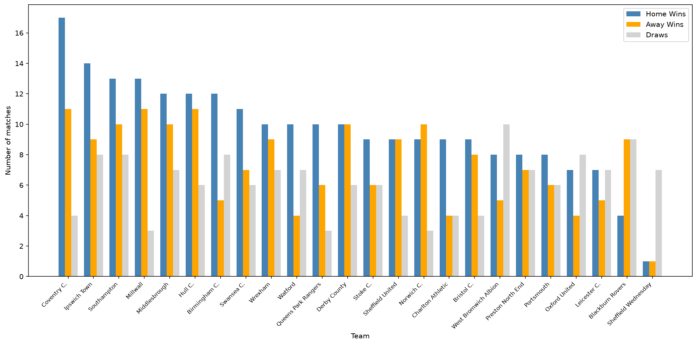

# -EFL-Championship---Analyzer
# EFL Championship 2025/26 Analyzer

A data analysis project that measures what happened in the Championship last season — and tries to explain why it happened.

## Motivation

I'm transitioning into tech and learning Python and SQL. I wanted to build something real rather than just follow tutorials, so I combined two important aspects of my life: coding and football. The Championship is one of the most competitive leagues in the world and produces fascinating data stories every season.

## What This Project Does

- Fetches live match and standings data from the football-data.org API
- Stores it in a local SQLite database for analysis
- Runs SQL queries to find patterns and insights
- Generates visualizations to tell the story of the season clearly

## Key Findings — 2025/26 Season

- **Coventry City** won the title with 95 points, dominant in both attack (97 goals) and defense (45 conceded)
- **Coventry's home record** (17 wins) was the foundation of their title — they were nearly unbeatable at St. Andrews
- **Sheffield Wednesday** had one of the worst seasons in Championship history, finishing with 0 points after a record points deduction
- **Home advantage** was significant across the league: 232 home wins vs 177 away wins across the full season
- **Blackburn Rovers** showed an unusual pattern — more away wins (9) than home wins (4)

## Visualizations

### Final Standings


### Home vs Away Performance


## Technologies Used

- **Python** — data fetching, processing, and visualization
- **SQLite** — local database storage and SQL analysis
- **matplotlib** — data visualization
- **football-data.org API** — live football data source

## How To Run

1. Clone this repository
2. Create a `config.py` file in the project folder with your API key:
```python
API_KEY = 'your_key_here'
```
3. Get a free API key at football-data.org
4. Install matplotlib:
5. Run the main script to fetch and store data:
6. Run the charts script to generate visualizations:


## About Me

I'm Eduardo, a career changer learning Python and SQL with a goal of landing a junior developer or data analyst role. This project is part of my portfolio as I build real things with real data.

---
*Data source: football-data.org*
